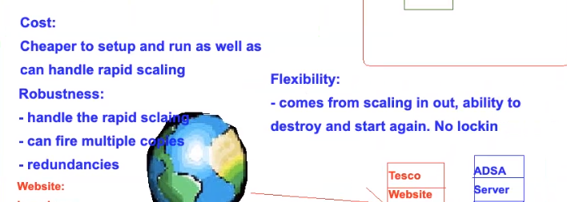

# Networking theory

## Networks
**relationship between two computers**
- this is then expanded to multiple computer and multiple machines for complex networks

## IPs
**what are they?**
- IPs - easy for humans to understand, but binar needed for computer understanding
- actually binary behind the IP, translated into binary by the computer(see submask)

## IPv4 vs IPv6
- differing IP configurations

## Submask
**a third IP that tells you wher to match IPs to be in the same network**

Computer A - 192.65.63.1
Computer B - 190.65.30.1

May be in same network - dont know without understanding submask

255.0.0.0 then not on the same network
0.255.0.0 then on the same network

**why this happens**
- done as only tests where binary is not zero (where value between dots is not zero)
- 0 in binary = 00000000 and 255 in binary =11111111
- so in first case tests that 192 in binary (11000000) not same as 190 in binary (10111110)
- but then in second finds that 65 in binary same as 65 in binary (both 01000001)
- submasks used to understand if on same submask - 2 to power 32 combinations 4,2 billion

**sub masks and CIDR blocks**
- CIDR = classless inter-domain routing
- CIDR block represents a set submask as block at end of an IP
- does this by adding the bits
- IPv4 you can have a maximum of 32bit, when adding the 8 bits inisde the 4 octets
- 192.65.63.1/16 - 16 is the cidr block

## CIDR Block

**explanation**
- /0 = submask represenation of 00000000.00000000.00000000.00000000
- /8 = submask represenation of 11111111.00000000.00000000.00000000
- /16 = submask represenation of 11111111.11111111.00000000.00000000 
- 256 * 256  ips avialable to connect on server
- important when setting autocale group to scale out
- gives a limit to horizontal scaling
- /24 = submask represenation of 11111111.11111111.11111111.00000000
- /32 = submask represenation of 11111111.11111111.11111111.11111111
- means /32 needs ips to exactly same
- means /0 menas ips can be anything
- more division = less computer inside network

## N-Tier Architecture
**defintion**
- n = any number
- division of system into logical tiers
- usually done with networking, and increase robustness and flexibility
- app tier, db tier. Flexibility created due to 
- app tier contains JS server
- db tier containts mongo db

**mutable vs immutable**
- instagram app is immutable as layout is always same.
- so can create multiple app machines if one goes down, easy to replicate/scale up and down
- database is mutable, may go down and lose some data
	- one is main database, others take other is needed
	- more servers to ensure less down time

## Monolith archiecture

- single "block" network
- eg. on server running BD + logic + presentation etc.
- mainframe = JS server running everything
- server and website on same mainframe meanes if any of the components fail then website goes down
	- associated costs with that
- no flexibility or robustness, high costs, low ease of use

## Micro Services

- Application structured as collection of services
- Highly maintainable and testable
- Orgnaised by small teams and business needs
	- Works better in agile enviornment when change can be done iteratively
- Micro services talk to each other kubernetes and docker swarm

**micro services business example**
- tesco contracted us to handle all cheese sales
- API tier accessed to and from tesco
- This then interacts with db tier
- app tier interacts with db tier alongside CRUD guidelines
	- create, record, update delete
- micros services would be to break down websites functions into differnt servers
	- e.g internally adding more cheese and externally buying more cheese
	

## Difference betwen Micro and Monolith

- Micro services not best in small organisation
	- Best to keep it simple
	

## VPC
**what is a vpc?**
- a vpc is a virtual private cloud, where can define a virtual network to launch aws resoucres in
- tier 2 means seperating servers into app and db for example
- this creates a multi tier architecture and is therefore more robust

**what is inside a common 2 tier vpc?** 
- a vpc
- a subnet
	- a segment of a VPC’s IP address range where you can place groups of isolated resources
	- can be used to limit ips used
- a gateway
	- internet gateway
	- nat(netork address translation) gateway
	- virtual private(amazon vpc side of a vpn connection) gateway
	- this last option moves the IP address to make networks more secure
	- this is due to multiple encryptian levels and ips which require log ins
- peering connection
	- enables you to route traffic via private IP addresses between two peered VPCs
- vpc endpoints
	- enables private connectivity to services hosted in aws, from your vpc
	- this isses a gateway or firewall proxies
- egress only internet gateway
	- a stateful gateway 
	- provides exit only eaccess for IPv6 traffic from vpc to the internet
