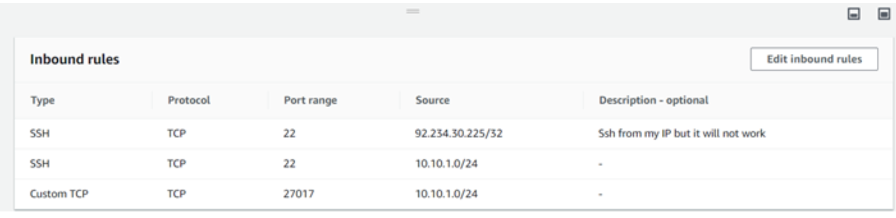
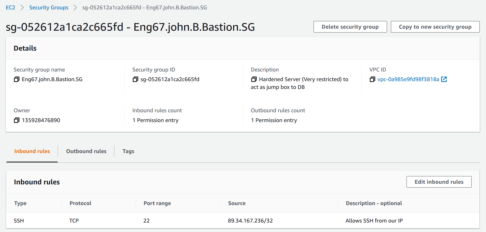

## Dependencies

Git bash

Existing VPC per previous instructions

## Task - run nodejs, as a follow up from previous task


### 1. Add inbound rule to private NACL

A. Add below inbound rules. The second rule is temporary until the bastion server IP is stablised
```
100, Custom TCP Rule, TCP (6), 27017, 245.20.1.0/24
	
110, SSH (22), TCP (6), 22, 245.20.1.0/24
```

B. Add below outbound rule

``` 100, All traffic, port range all, 245.20.1.0/24 ```

### 2. Launch EC2 instance for VPC db instance

A. Select Ubunutu version 16.04, next then micro t2

B. Select your VPC network

C. Use the private VPC subnet

D. You don't need a public IP, but can add one optionally

E. Select standard storage

F. Create an appropriate tag (Eng67.Max.DBinstance.VP)

G. Security is handled below

### 3. Create security group for the VPC db instance

A. Inbound rules per picture below



B. Use the DevOps student key pair 
	
### 4. Launch EC2 instance for VPC Bastion istance

A. Select Ubunutu version 16.04, next then micro t2

B. Select your VPC network

C. Use the public VPC subnet

D. You need a public IP, so enable public IP

E. Select standard storage

F. Create an appropriate tag (Eng67.Max.P.Bastion)

G. Security is handled below

### 5. Create security gorup for the VPC Bastion instance

A. Inbound rules per picture below



B. Use the DevOps student key pair 
	
### 6. Copy SSH key into bastion server

A. Change folder into the .SSH folder, from your user folder

```cd .ssh```

B. Transfer the key into the Bastion server

```scp -i ~/.ssh/DevOpsStudents.pem DevOpsStudents.pem ubuntu@BASTION_PUBLIC_IP:/home/ubuntu/.ssh/```

### 7. Enter the bastion server

A. Run the below command, this will enter the bastion machine

```ssh -i ~/.ssh/DevOpsStudents.pem ubuntu@BASTION_PUBLIC_IP```

B. Confirm the SSH key is inside the server. Run these commands. 

``` 
cd .ssh
ls
```

C. You should see something called "DevOpsStudents.pem"


### 8. Enter the DB instance within the VPC using its private IP from the bastion server

A. Change permissions

```chmod 400 DevOpsStudents.pem```

```ssh -i ~/.ssh/DevOpsStudents.pem ubuntu@PRIVATE_DB_VPC_IP```

## Bastion server Theory

- Allow port 27017 from the public subnet

- Port 22 into private subnet db database, should only connect to bastion server

- Bastion server will have tough security, bar tiny door for entering from your ip

	- gate 22 to your db

	- gate 22 to your IP
