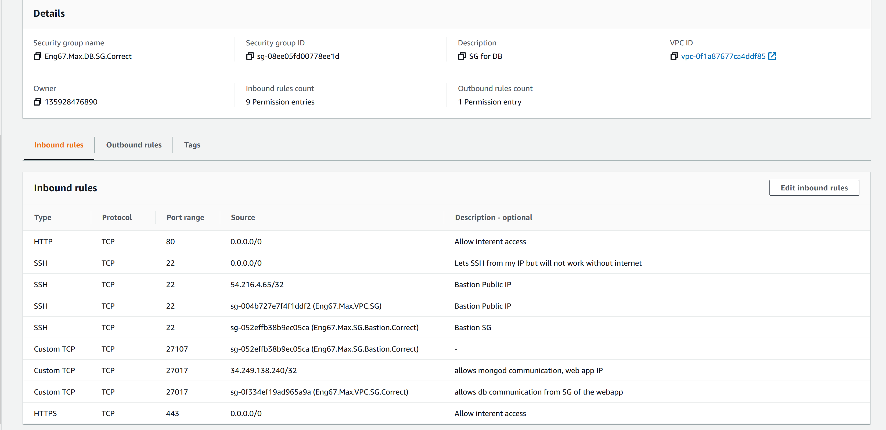

# Getting Posts working on web-app

## Change rules for the VPC Security Group

1. Configure the rules as per the picture below


- The covered up IP needs to be your IP

## Change rules for the VPC DB Security Group

1. Configure the rules as per the picture below



## Check rules for Bastion Secruity Group

1. Configure the rules as per the picture below


- The covered up IP needs to be your IP

## Configure the Private Subnet on the Route table

1. Add the internet gateway and destination of 0.0.0.0/0 for the private Subnet

## Configure the Public NACL

1. Configure it per the below pictures


## Configure the Private NACL

1. Configure it per the below pictures


- Port 80 and 443 allow internet access
- Port 1024-65535 is the epheremerla port

## Create an APP instance

1. If already created may need to create one. Else follow the below steps. 

2. Create an instance per normal specifications

3. The VPC selected should be yours, and the subnet your public one
	- Enable public IP
	- Security group is the VPC group

4. Transfer the provision file into the app folder

```
scp -i ~/.ssh/DevOpsStudents.pem -r ~/FOLDER WITH PROVISION FILE ubuntu@APP_IP:/home/ubuntu
```
5. Then enter the app and run it

```
ssh -i ~/.ssh/DevOpsStudents.pem ubuntu@APP_IP
cd app
npm install
node app.js
```

## Configure an Database instance

1. If already created may need to create one. Else follow the below steps. 

2. Create an instance per normal specifications

3. The VPC selected should be yours, and the subnet your private IP
	- Enable public IP
	- Security Group is the DB on VPC group


## Provision the Database Instance

1. Enter the DB from the Bastion server. This includes transfering files into bastion then into the DB

```
scp -i ~/.ssh/DevOpsStudents.pem -r environment/ ubuntu@BASTION IP:/home/ubuntu/environment
ssh -i ~/.ssh/DevOpsStudents.pem ubuntu@BASTION IP
scp -i ~/.ssh/DevOpsStudents.pem -r environment/ ubuntu@DB PRIVATEIP:/home/ubuntu/environment
ssh -i ~/.ssh/DevOpsStudents.pem ubuntu@DB PRIVATEIP
```

2. You will need to already have transferred the key (see networking V2)

3. Resolve the host error

```
cd /etc
sudo nano hosts
```

A. Add the below line at the top of the file

```127.0.1.1 ip-DB PRIVATE IP # Inserted to remove IP error```

4. Correct the provision file

A. Edit provision file for bad file location

B. Replace with line below:

```
sudo rm /etc/mongod.conf
sudo ln -s /home/ubuntu/environment/db/mongod.conf /etc/mongod.conf
```

5. Go to the home page of the Virtual machine, then provision the DB

```./environment/db/provision.sh```

6. Enable Mongod

```
sudo systemctl restart mongod
sudo systemctl enable mongod
sudo systemctl status mongod
```

## Connect the APP to the Database

1. Within the APP server run below the command

```export DB_HOST=mongodb://DB PRIVATEIP@:27017/posts```

2. Create the connection

```
npm install
pm2 stop all
node app.js
```

## Resecuring the VPC

- Remove the Internet Gateway from the private subnet
- Close the SGs
- Close NACLs

