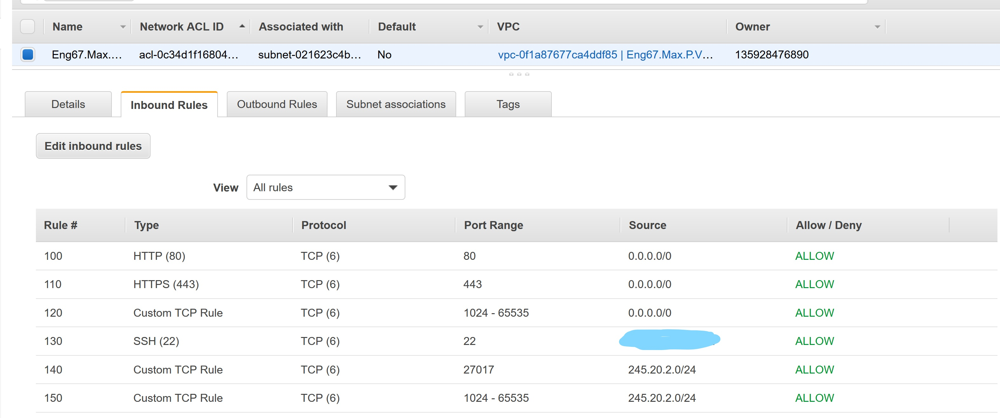
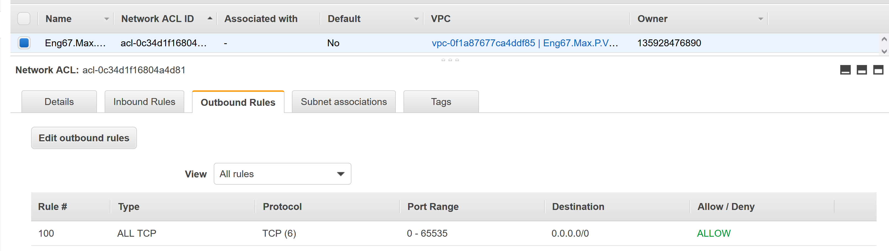

# Virtual private network set-up

## Dependencies
- App set up per below link:
	- https://github.com/Lycurgus1/NodeJSAppPipeline

- Git Bash
	- This is used to access and manipulate the machines
	- Download it here (alongisde other git softwrare): https://git-scm.com/downloads

## Installation steps
### Task
- create VPC
- create private subnet within VPC
- create public subnet with VPC
	- with app
- create internet gateway for public subnet
- create route table with public and private route
- deploy app

### 1. select vpc from aws services

A. ensure region is ireland

### 2. create vpc from vpc menu not wizard

A. tag = Eng67.Max.P.VPC

B. Ipv4 CIDR block = 245.20.0.0/16

	- This could be changed, with 245 being anything from 1-255 and 20 being similar

	- However the zeros must remain there

C. leave everything else >> create vpc

### 3. create internet gateway

A. click on internet gateway - create

B. tag = Eng67.Max.P.IGW

C. attach to vpc

D. select yours, attach gateway

### 4. create public subnet

A. click on subnets - create subnet

B. tag = Eng67.Max.P.Subnet.Public

C. select your vpc

D. 245.20.1.0/24 in IPv4 block

	- This IP is per the IP established from the VPC, with the third block changed

	- The third block is changed to establish a subnet within the VPC

E. create

### 5. create private subnet

A. click on subnets - create subnet

B. tag = Eng67.Max.P.Subnet.private

C. select your vpc

D. ip = 245.20.2.0/24, create

        - This IP is per the IP established from the VPC, with the third block changed

        - The third block is changed to establish a subnet within the VPC

	- This must be differnt to the IP created for your public subnet

### 6. create route table

**theory**
- want to build in rigidity to limit damage from lack of understanding junior member might do
- make clear connecting to internet
- want to default to private

**steps**

A. check route table not assoicated with VPC already
	- keep for now
	- rename
	
B. Select route tables, create route table

C. Add tag =Eng67.Max.P.Route.Public

D. select your vpc

E. create vpc

F. Edit Route - add 0.0.0.0/0
	- target = internet gateway, choose your internet gateway
	
G. Subnet associations
	- edit subnet associations
	- add public subnet

### 7. Secrity group

**theory**

- egress rules
	- defualt 0.0.0.0/0 auto set
	- allows everything to exit
	- ingress rules (rules for entry)
	- nacls for public
	- by default outbound traffic is denie	
	- is stateless?
	- rule numbers matter
	- can deny IP as well as allow
	
- ingress rules 
	- port 22 from our IP
	- 80 for inter
	- 443
	- ephemeral on 0.0.0.0/0
	- 27017 to allow connection to private (db) subnet
	
- egress rules
	- allow all for now
	
- rules for public server
	- allow all outbound traffic to public server (245.20.1.0/24)xc
	- ingress 27017 from public server (245.20.1.0/24)
	
**steps**

A. create new nacl

B. tag = Eng67.Max.P.Route.NACL

C. add rules

Y	- inbound rules per the below image (my IP is blacked out):


	
	- outbound rules per the below image:
	


### Testing

A. create an ec2 instance with VPC of the one just created

B. ssh into the instance

C. run ```sudo apt-get install nginx```

D. go onto your browser and insert the IP of the instance created

E. if VPC has been created effectively then you will nginx install successful

## Theory underpinning this

**terms**

VPC - virtual private cloud, allows creaion of virtual private network

IGW - internet gateway

Subnet - internal networking 

NACLs - network access control lists - firewall at level of subnet

Route Tables - set of rules determinied where traffic from subnet of IGW is directed

SG - firewall at level of EC2

EC2 - elastic computing 2

**background knowledge**

code is cheap, database is expensive

database should not have internet acces

aws has regions - clustered data centers
	- within region it has avilability zones. Logically connected by physically seperate


